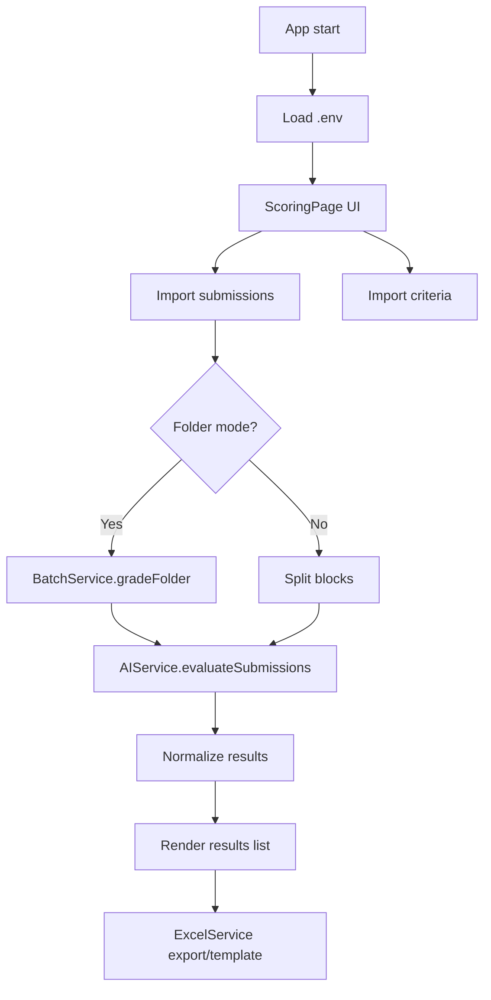

# Project flow and architecture

This document explains how the app works, how data moves through the system, and how each major part fits together.

## High-level flow
1. App starts and loads .env to read GROQ_API_KEY.
2. UI presents a two-column layout with import actions on the left and output/actions on the right.
3. User imports submission files (folder or multi-select) and a criteria file (TXT or DOCX).
4. App builds the prompt and sends submissions + criteria to Groq through AIService.
5. Results are normalized and displayed in the results list.
6. Results can be exported to a new Excel file or applied to an existing template.

## Runtime bootstrap
- Entry point: lib/main.dart
- main() calls WidgetsFlutterBinding.ensureInitialized() and dotenv.load(fileName: ".env").
- The Groq API key is read from GROQ_API_KEY in .env at runtime.

## UI layout and user actions
- The app uses a two-column layout when the window is wide (>= 900px).
- Left column (inputs/imports):
  - Template Excel (optional)
  - Student submissions (folder import and status)
  - Grading criteria document import
- Right column (outputs/actions):
  - Output Excel file location
  - Question image (optional)
  - Progress indicator (folder mode)
  - Grade button
  - Results list and Export button

## Submission intake
- Folder import uses FilePicker.getDirectoryPath().
- The app lists and sorts .txt files using FileService.listStudentFiles().
- Each file is read, labeled, and combined into a structured block:
  - "--- Student Name: ... ---"
  - "Alias: ..."
  - "Content: ..."
- The combined blocks are stored in _studentsController for evaluation.

## Criteria intake
- Criteria file can be TXT or DOCX.
- TXT is read directly from picked bytes.
- DOCX is parsed by unzipping and extracting word/document.xml in FileService.readDocxFile().

## Grading flow
- The Grade button triggers _evaluateWithAI().
- Preconditions:
  - GROQ_API_KEY exists.
  - Submissions are available (folder or combined blocks).
  - Criteria text exists.

### Folder mode (batch)
- If a folder path is selected, the app uses BatchService.gradeFolder().
- BatchService:
  - Reads files and builds student blocks.
  - Splits blocks into batches based on estimated prompt token size.
  - Sends batches sequentially with delays to respect rate limits.
  - Retries on transient failures and handles 413/rate limit cases.
  - Reports progress via a callback.

### Text mode (single)
- If the combined blocks are in _studentsController, the app splits into blocks.
- Each block is sent as a single submission to AIService.
- Results are accumulated and progress updates are shown.

## AIService request/response
- AIService builds a prompt via buildPrompt() with:
  - Grading rules
  - Criteria text
  - Submission blocks
- It calls Groq chat completions and expects a JSON array of results.
- Response is sanitized for code fences and parsed as JSON.

## Results normalization
- _normalizeResults() fills missing alias values by extracting a numeric ID
  from studentName when possible.
- Results are stored in _evaluationResults and shown in the results list.

## Excel output
- ExcelService supports two paths:
  - exportResults(): writes a new Excel file with Student Name, Score, Feedback.
  - fillTemplate(): finds headers in an existing template and fills rows by alias.
- fillTemplate() supports single-row or two-row headers and writes to *_filled.xlsx.

## FileService utilities
- readDocxFile(): parses DOCX into plain text.
- listStudentFiles(): lists and sorts .txt files by numeric name.
- readStudentFolder(): builds a combined block for all students (not used directly
  in the current UI but useful for batch processing).

## Environment configuration
- .env (ignored by git) contains GROQ_API_KEY.
- .env.example shows the expected key format for setup.

## Data flow diagram

## Key files
- lib/main.dart: UI, orchestration, and user flow.
- lib/services/ai_service.dart: Groq API calls and JSON parsing.
- lib/services/batch_service.dart: batch sizing, throttling, retries.
- lib/services/file_service.dart: file and DOCX handling.
- lib/services/excel_service.dart: export and template filling.
- .env / .env.example: environment configuration.
